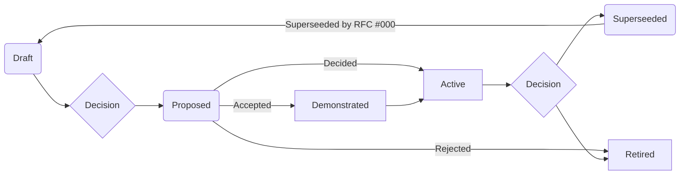
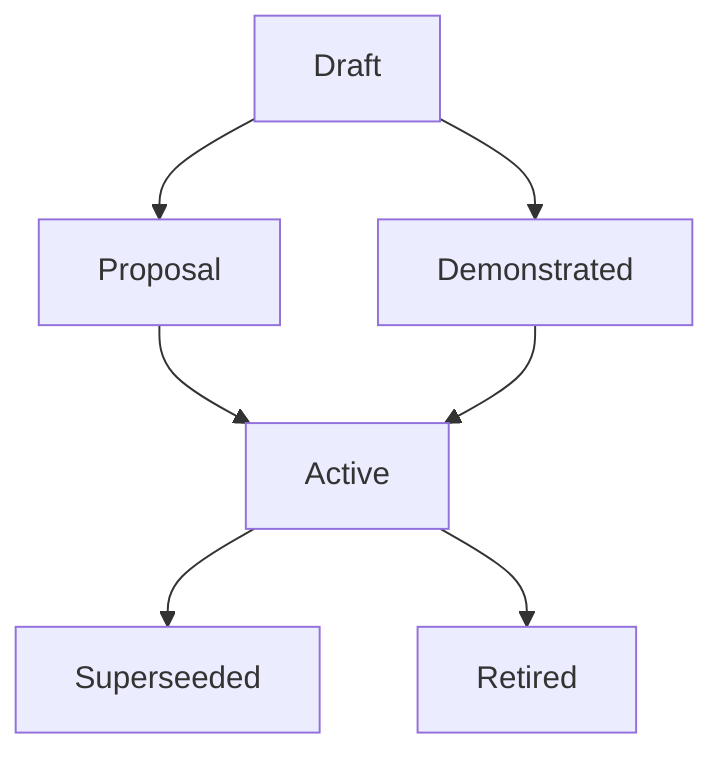

# Project-Origin RFCs
**Note**: This document has been adapted from the [Energy Track and Trace](https://github.com/Energy-Track-and-Trace) project. 

### RFC Categories:

-   `01` Format - fundamental shared dataformat.
-   `02` Model - implementation models and the considerations behind them.
-   `03` Protocol - is an API definition to reach agreement on a common interface.
-   `04` Environment - simulations and experiments for demonstration purposes and as a test harness. 
-   `05` Actions - that can be taken and is encouraged to be taken by the community.

## About Project-Origin RFCs
This collection of RFCs are in place to coordinate ideas and considerations around the development and deployment of functionalities in Project-Origin. it is a set of structured documents to discuss implementation patterns, considerations of design requirements etc. 

RFCs acts as an asynchronous record of information about the project. It is intended to be a working document to complement the exisiting conversations between organisations involved in the project. All involved parties are encouraged to read the existing RFCs and to contribute by sharing of insights using this RFC.  


## Guide for contributors and working group members
- If someone has a concrete RFC to propose, for review/discussion in the ETT consortium: post the RFC as an **issue**: [https://github.com/Energy-Track-and-Trace/ett-documentation/issues/new/choose](https://github.com/Energy-Track-and-Trace/ett-documentation/issues/new/choose). Discussion happens by replying in the issue. Once there is a conclusion, the issue will be converted in a **new branch**, in which the RFC document is being added. Consequently, the branch will then be merged into the main branch of the repository by starting a **pull request**.
- In case there is no concrete RFC (yet) but wants to open a discussion, user can start a new discussion: [https://github.com/Energy-Track-and-Trace/ett-documentation/discussions](https://github.com/Energy-Track-and-Trace/ett-documentation/discussions). If this discussion leads to an RFC, this can be done by opening an **issue** from the discussion panel.
## RFC process
An RFC is submitted by a member or group of members of the working group. A template is available here [template.md](/rfcs/template.md) or from the [browser](https://github.com/Energy-Track-and-Trace/ett-documentation/issues/new/choose). General inquiries, questions or suggestions should be addressed using the general [discussion](https://github.com/Energy-Track-and-Trace/ett-documentation/discussions). The lifecycle of an RFC is from draft - and subsequent proposal to the working group in a lifecycle that



Active proposals qualifies to be adressed by the architect teams in the working groups and acts as the stable current truth of the working group. An ADR Architectural Decision Record

### Status 
Status flags definition of the process and the subsequent progress in the work towards an Energy Track and Trace solution. The status of the RFC is according to the graph in 6 possible status stages. It is designed so business and technological RFCs can both reach **Active** recognition, that is the current practice in the working group. It can be superseeded by another RFC or retired by the working group. 



The proposal status is changed using pull-requests changing the status text on the RFC itself and on this README.md
NOTE: Flags are tentative and open for change depending on the process flow in the working groups. 

## How to RFC
A RFC is a Request For Comment and is in place to ease communication and workflow across organisations. An introduction video is available here to introduce the RFC concept [Thomas Sadler (BBC) at ISC.S11 - Using Internal RFCs to Enhance Collaboration](https://www.youtube.com/watch?v=U6zlghE0HcE).

### Submitting an RFC
Copy and paste [template.md](/rfcs/template.md) into your favorite editor, word will work fine - fill in the form to the best of your ability and get a colleague or member of the group to enter the RFC to the repository as a markdown document. Add your new and fresh RFC .md file to the correct category repository under [research](/rfcs/research) or [development](/rfcs/development). There is a handy cheatsheet for markdown.md [markdown style guide / cheat sheet.](https://github.com/MicrosoftDocs/Contribute/blob/main/Contribute/markdown-reference.md), if you want to know how make awesome graphs in markdown look at [mermaid](https://mermaid-js.github.io/mermaid/#/). You add it to the following to your markdown file:

```
'''mermaid
    insert mermaid code here;
'''
```
The RFCs are not required to resemble each other in structure completely the only required fields are the top index of the template from there on it is up to the author to present their proposal - according to Occams razor - the simpler the better. 

### Encouraging use of RFC
By adding a deadline - an preferrably having the RFC on the agenda there is a tie-in to everyday processes and the RFCs can be processed during these sessions. The deadline is in the template and should always be filled in as encouragement and call to action. 

### I need to know more
Here are some excellent examples of applying RFCs to enhance transparency and progress of a project within or between organisations
- [innerSource RFC template repository and book](https://github.com/InnerSourceCommons) 
    - [innerSource explanation of RFCs for cross-team-decision-making ](https://github.com/InnerSourceCommons/InnerSourcePatterns/blob/945c0227f69da90b8d9b8182d50c885fe081b469/patterns/2-structured/transparent-cross-team-decision-making-using-rfcs.md) - current RFC template.
- [deepdive into April 1. RFCs](https://www.rfc-archive.org/1+april+rfc#gsc.tab=0)

RFCs are the means to an end - enhance traction through a shared source of "truth", a set of working agreements and a shared view. It works as an asynchronous addendum to existing working processes and should in theory help raising a common understanding of the project.

- [requests-for-comments](https://en.wikipedia.org/wiki/Request_for_Comments)
- [30-years-of-rfcs](https://www.rfc-editor.org/rfc/rfc2555.txt)
- [rust](https://github.com/rust-lang/rfcs)
- [zeromq](https://rfc.zeromq.org)
- [uber](https://blog.pragmaticengineer.com/scaling-engineering-teams-via-writing-things-down-rfcs/)
- [open-decision-framework](https://www.redhat.com/en/about/press-releases/red-hat-releases-open-decision-framework-spur-transparent-and-inclusive-leadership)
- [bbc](https://www.youtube.com/watch?v=U6zlghE0HcE)
- [google](https://www.industrialempathy.com/posts/design-docs-at-google/)
